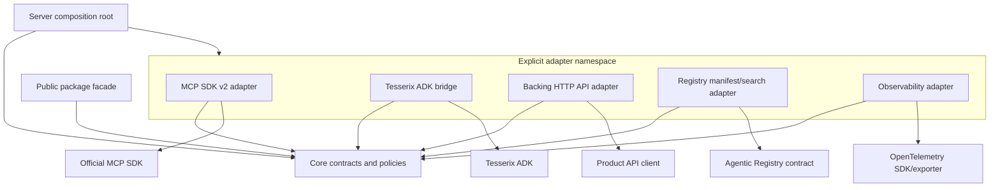

# ADR-0003: Public API and dependency layering

- Status: Accepted
- Date: 2026-08-30
- Tracking: [tesserix-mcp-runtime#4](https://github.com/tesserix/tesserix-mcp-runtime/issues/4)
- Supersedes: none

## Context

The runtime must be reusable as a Python library without making server authors
import MCP SDK internals, ADK implementation types, deployment clients, or
control-plane code. The official MCP Python SDK remains the protocol owner. The
Tesserix ADK remains the owner of ADK tool descriptors, registry behavior, and
its `McpServer`. Agentic Registry and the platform GitOps repositories remain
the owners of their schemas and desired state.

The security assets at this boundary are authenticated tenant authority, tool
schemas, downstream credentials, and tool inputs and results. A hostile tenant,
a compromised integration dependency, or an accidental contributor import must
not gain a path around authorization or cause core to retain payloads. The
trust boundary is each adapter: it validates external data and converts it to
runtime-owned protocols. Core never treats a transport, SDK, or Registry value
as trusted merely because another process parsed it. Issue #5 owns the complete
cross-system threat model.

ADR-0001 sets the production envelope at 50 sustained and 200 burst calls per
second per pod, 64 KiB requests, 512 KiB responses, 99.9% monthly invocation
availability, and no more than 15 ms p99 runtime-added latency. Package layering
adds no network hop and no runtime decision. It must therefore add effectively
zero request latency and no new availability dependency.

## Evidence and budgets

The 2026-08-30 Python 3.14 clean-install observation was:

| Measure | Observation | Review budget |
|---|---:|---:|
| Runtime wheel | 8,621 bytes | 65,536 bytes |
| Installed file content | 26,396,582 bytes | 67,108,864 bytes |
| Installed distributions including runtime | 29 | 36 |
| Universal locked distributions including conditional targets | 31 | 36 |

The universal lock contains Windows and Emscripten alternatives that are not
installed together. The count budget deliberately evaluates that conservative
universal set. The installed-size budget is measured in a clean environment,
not the development environment.

The only direct base dependency is `mcp>=2.1.1,<3`. Its current transitive tree
is recorded in `architecture/dependency-report.json`. Core must not resolve ADK,
Google ADK, A2A, Temporal, Postgres clients, Kubernetes, model providers,
Graphiti, Redis, Torch, or Transformers. An MCP-owned transitive dependency is
not a runtime-owned abstraction and must not be imported by core.

Crossing a budget is not automatically forbidden. It requires a reviewed
report update that identifies the new package, explains why a standard-library
or existing dependency cannot do the job, and includes a new clean-install
measurement. Silent dependency growth fails CI.

## Decision

### Distribution shape

The distribution is library-first. Server entrypoints, a publisher CLI, and a
container image may compose the library later, but none becomes the only way to
reuse runtime behavior. The base installation provides the stable contracts and
the official MCP SDK dependency. It does not install deployment, Registry
client, backing API, ADK, provider, database, or telemetry-exporter packages.

There are no project extras yet. Every future `[project.optional-dependencies]`
entry automatically becomes a required profile in the dependency report; a
lock or extra change fails until its exact tree and budgets are reviewed. Empty
or knowingly unresolvable extras are forbidden because they advertise an
installation path that does not work.

### Dependency direction

Imports point toward the stable core. The core has no I/O imports.

The reverse arrows are forbidden:

- core modules do not import `tesserix_mcp_runtime.adapters`;
- core modules do not import MCP, ADK, HTTP, Registry, Kubernetes,
  observability, database, orchestration, or model-provider libraries;
- one adapter may not become a shared service locator for another adapter;
- deployment and publishing code compose the library but never enter core.

The current core prefixes are `contracts`, `application`, `context`, `errors`,
`lifecycle`, `policy`, and `tool`. Modules arrive only with their owning issue;
empty implementation scaffolds are not required to preserve this decision.
The adapter namespace reserves these responsibilities:

| Adapter responsibility | External owner | Delivery issue |
|---|---|---:|
| MCP Streamable HTTP and SDK conversion | Official MCP Python SDK | #10 |
| ADK registry and server bridge | Tesserix ADK | #11 |
| Product backing HTTP calls | Product-owned clients/APIs | #8 and adopters |
| Registry manifests and search | Agentic Registry contract | #18 and #20 |
| Traces, metrics, and logs | OpenTelemetry/platform observability | #16 |

`import-linter` 2.14 enforces the installed import graph. The AST architecture
check also guards reserved core prefixes before every module exists and emits a
machine-readable violation report. The public API and dependency checks provide
the other two release invariants.

### Contract ownership

Each boundary representation has one authoritative owner:

| Representation | Authoritative owner | Runtime behavior |
|---|---|---|
| `Tool`, `CallContext`, `Authorizer`, `CredentialProvider`, `Telemetry`, `Clock`, `Lifecycle` | `tesserix_mcp_runtime.contracts` | Re-export the same objects from the package facade |
| MCP requests, results, schemas, capabilities, and protocol errors | Official `mcp` / `mcp-types` packages | Convert only inside the MCP adapter; never copy their models |
| ADK descriptors, registry views, approvals, refusals, and `McpServer` | `tesserix_adk` | Adapt the existing objects; never regenerate ADK semantics |
| Agentic Registry server and discovery manifests | Agentic Registry specification | Generate or validate at its adapter boundary; do not create a second registry model |
| Deployment desired state | Product GitOps and `tesserix-k8s` | Consume runtime probes and image metadata; never import Kubernetes into core |

Runtime protocols use structural typing so an adapter implements the consumer's
need without forcing core to inherit an SDK base class. The package facade is
the supported import path. Adapter imports are explicit and adapter-specific;
adapter names are not re-exported from the root.

### ADK source and opt-in

`tesserix-adk` returned HTTP 404 from PyPI on 2026-08-30, so an index dependency
or `tesserix-mcp-runtime[adk]` extra would be broken. The verified ADK v0.53.1
GitHub release is built from commit
`abdd2dfebf839662d99200e979c19d99feb45649` and publishes:

- `tesserix_adk-0.53.1-py3-none-any.whl`;
- SHA-256 `eec6afc695518971f44723e520cf43f0997110d013ce4733f8d6d30ec96b8bdb`.

An ADK server pins that wheel and hash in its own application lock, then imports
the single runtime ADK bridge delivered by issue #11. It installs the ADK base
package without the ADK `all`, `google-adk`, `temporal`, `postgres`, or provider
extras. A production image may instead inherit the verified
`base-python-adk-3.14:20260829` image by digest
`sha256:5a6fd1863ed7f37f3929cc596d0ec063c3077c11713cd334f14d1df2b30ef386`.

The bridge is an adapter, not a core mode. ADK being absent makes only that
adapter unavailable; importing and installing core continues to work. A future
Tesserix package index may make an `adk` extra valid, but adding it requires its
own dependency profile and does not change core contracts.

### Public API and compatibility

`tesserix_mcp_runtime.__all__` is the complete stable root surface. The checked-
in snapshot records both each exported name and its authoritative owner. CI
fails on additions, removals, or rebinding, so a reviewer must accept every
public change deliberately.

Compatibility follows these rules after the first published runtime release:

1. Patch releases preserve exported names, call signatures, protocol behavior,
   and serialized output.
2. Minor releases may add exports, optional protocol members, fields with
   defaults, and enum values only where consumers already handle unknowns.
3. A name or behavior is deprecated with `DeprecationWarning`, documentation,
   and a replacement for at least two minor releases and 90 days.
4. Removal, required parameters, type narrowing, or incompatible serialized
   data requires a major release. The old and new edge adapters overlap during
   migration.
5. MCP and Registry wire changes follow their owners' versioning. Runtime code
   converts at the adapter and does not mutate copied schemas.
6. `CallContext` is an in-process authority protocol, not a serialization
   format. A transport reconstructs it only after authentication and validation.

Before the first release, snapshot changes are permitted only in the PR for the
owning issue. The snapshot is still mandatory so pre-release drift is visible.

## Failure behavior

| Failure | Result |
|---|---|
| ADK wheel or image is unavailable | ADK consumer build fails reproducibly; core consumers are unaffected and do not fall back to an unpinned source |
| MCP SDK moves a concrete type | Compatibility and adapter tests fail; only the MCP adapter changes |
| Core imports an adapter or integration package | Import Linter or the AST architecture test fails before merge |
| Public export moves or changes without review | Public API snapshot check fails with a diff |
| Lock gains a forbidden or unexpected dependency | Dependency report check fails with the exact resolution diff |
| Wheel or clean install crosses a size budget | Build fails and requires measured review; no runtime degradation path is involved |
| Registry, backing API, or telemetry is unavailable | Its owning adapter applies the bounded failure policy from ADR-0001; core does not gain a hidden network fallback |

The build-time checks are deterministic and use no production network or data.
At runtime, adapter calls still propagate deadlines and cancellation and must be
idempotent where their owning operation permits retries; this ADR introduces no
cross-system transaction.

## Migration, rollback, and cost

This repository has no released consumers, so the initial migration is to
import contracts from `tesserix_mcp_runtime` and integrations from the explicit
adapter namespace. Later internal-name adopters receive a public re-export or a
documented deprecation window rather than a silent move.

Rollback restores `pyproject.toml`, `uv.lock`, the public API snapshot, and the
dependency report together, then republishes the previous immutable wheel or
image digest. Rolling back only the lock or only the snapshot is invalid because
the executable and declared contract would disagree. A wire-contract rollback
keeps both adapter versions available until active clients have drained.

The design adds no service, datastore, queue, request hop, or production control
plane. Its incremental cost is a few seconds of CI graph/export work and at most
the accepted package footprint. Compute, image storage, and operational costs
remain those quantified in ADR-0001.

## Alternatives considered

### Container-only distribution

Rejected. It prevents in-process reuse, makes tests depend on deployment, and
forces every server to copy composition behavior.

### CLI-first distribution

Rejected. A CLI is useful for publishing but cannot be the only supported path
for embedded server composition.

### Re-export official SDK and ADK concrete types

Rejected. Upstream moves would become public runtime breaks, and one concept
would acquire two schema owners.

### Build a provider-neutral MCP abstraction

Rejected. The official SDK is the selected protocol implementation; another
full abstraction would duplicate it without a second provider.

### Put all adapters in core dependencies

Rejected. Every non-ADK server would install unrelated providers, stores,
orchestration, and control-plane clients, enlarging both supply-chain and runtime
blast radius.

### Publish a GitHub direct URL as an `adk` extra

Rejected while ADK is absent from the package index. It would make runtime wheel
metadata depend on a non-index host and could make index publication invalid.
The consuming application or digest-pinned ADK image already owns that source
decision and lock.

### Split every adapter into a distribution now

Rejected until independent release cadence or dependency pressure justifies it.
Explicit modules and lazy optional imports preserve a future split without
creating multiple empty packages today.

## References

- [ADR-0001](0001-runtime-ownership-and-envelope.md)
- [ADR-0002](0002-python-and-mcp-compatibility.md)
- [Import Linter forbidden contract](https://import-linter.readthedocs.io/en/stable/contract_types/forbidden/)
- [MCP Python SDK v2.1.1](https://github.com/modelcontextprotocol/python-sdk/releases/tag/v2.1.1)
- [Tesserix ADK v0.53.1](https://github.com/tesserix/agent-development-kit/releases/tag/v0.53.1)
- [Tesserix ADK MCP server](https://github.com/tesserix/agent-development-kit/blob/v0.53.1/docs/mcp-server.md)
