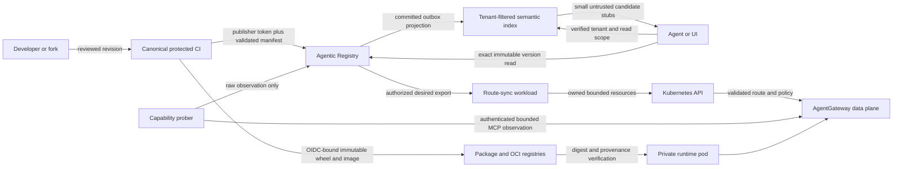
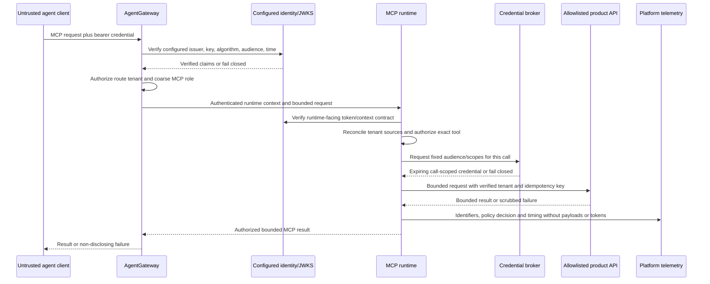

# ADR-0004: Cross-system threat model

- Status: Accepted
- Date: 2026-08-30
- Decision owners: Tesserix MCP runtime and platform security maintainers
- Tracking: [tesserix-mcp-runtime#5](https://github.com/tesserix/tesserix-mcp-runtime/issues/5)
- Supersedes: none

## Context

An MCP server reaches the platform through more than one release or request
boundary. Source is reviewed in CI, immutable packages and images are
published, Agentic Registry accepts an authorized artifact, semantic discovery
finds candidates, a reconciler projects desired routes into Kubernetes and
AgentGateway, and an authenticated call finally reaches a runtime and a
product-owned API. A weakness at any one hop can turn catalog metadata into
execution authority, expose another tenant's object, substitute an artifact,
or leak a credential.

The assets, actors, assumptions, 22 trust-boundary crossings, threats,
compromise cases, effects, secret classes, incident responses, fake review
requests, and 50 planned negative tests are normative in
[`security/threat-model.json`](../../security/threat-model.json). The JSON is
the detailed review record; this ADR explains the system decision and operating
rules. [`security/check_threat_model.py`](../../security/check_threat_model.py)
rejects incomplete or untraceable reviewed models in CI.

The model intentionally contains no token, credential, tenant payload, or
copied deployment manifest. All identities in example requests are synthetic,
all ordinary example network names use the reserved `.invalid` top-level
domain, and the link-local metadata address appears only as an input that must
be rejected before any fetch.

## Decision

Use independently authenticated, default-deny boundaries from publication to
invocation. A previous component's assertion is input, not authority. Each
receiver validates shape, authenticates a locally configured issuer or workload
identity, authorizes the exact object and action, applies resource limits, and
records a payload-free decision before performing an effect.

Five invariants apply to every implementation issue:

1. Tenant, subject, role, audience, scope, effect, approval, and tool authority
   are derived from verified context and authoritative state. Headers, paths,
   arguments, `_meta`, descriptions, manifests, search scores, and backend
   responses cannot supply them.
2. Semantic search returns tenant-filtered candidates only. An exact immutable
   version is fetched and authorized again before review, activation, or use.
3. Publication does not directly create a public route. Registry desired state,
   authenticated reconciliation, verified image provenance, health observation,
   and attached Gateway policy are separate gates.
4. AgentGateway is mandatory, but it is not the final authorization boundary.
   The runtime reconstructs an immutable call context, rechecks tenant and
   per-tool policy, and issues only a call-scoped downstream credential.
5. Unknown and unauthorized cross-tenant objects are indistinguishable. No
   component leaks claim contents, route existence, tool existence, backend
   behavior, or policy details in an error.

Network location, an internal hostname, a service mesh peer by itself, and a
trusted-proxy header received from an untrusted peer are never authentication.

## Publish, discover, and activate flow

The Registry is the catalog and desired-state owner, not an invocation proxy.
The Gateway does not "pick up" arbitrary packages. Canonical CI publishes an
immutable artifact; the Registry commits a version; authenticated route-sync
reads an authorized export; GitOps and the reconciler create only allowlisted
Gateway resources; and traffic switches only to the exact eligible, deployed,
healthy version. An existing route remains last-known-good during Registry or
reconciler failure. A new or changed version stays inactive.

Semantic discovery follows a two-stage contract:

1. Apply tenant, visibility, lifecycle, kind, and policy filters before vector
   ranking.
2. Embed only bounded, redacted, explicitly untrusted descriptive fields.
3. Return a small candidate stub with an opaque artifact identity and version.
4. Resolve that exact immutable version through the authoritative Registry
   access path and recheck object authorization.
5. Treat score, neighbors, labels, and descriptions as hints. They cannot grant
   visibility, activation, invocation, scopes, effects, or approval.
6. Bind any approved write capability to the resolved version and schema
   digests. A changed description or schema requires another review.

This permits reusable tools to be found efficiently without copying the
Registry, loading every tool into an agent, or letting natural-language content
become executable authority.

## Invoke flow

The Gateway-to-runtime credential contract is delivered by issue #12. Until it
exists and its negative tests pass, an internet-facing runtime is blocked. A
mesh identity may authenticate the calling workload, but it does not establish
the end-user tenant, tool, scope, or effect.

## Claim trust contract

The exact per-crossing lists live in the model. Implementations may trust only
the following classes after local verification; the final column is always
untrusted input.

| Receiver / boundary | Locally verified authority | Never authority |
|---|---|---|
| Canonical CI (`P01`) | repository and workflow identities, protected ref, exact commit, actor identity | tenant, namespace, reviewer, or release authority in submitted source |
| Artifact registry (`P02`) | release-job OIDC identity and immutable registry digest | tag text, filename, image label, or caller-supplied digest |
| Registry publish API (`P03`) | configured issuer/audience, subject, time and replay claims, publisher scopes, authoritative tenant-to-namespace mapping | manifest tenant, role, credential, private URL, or self-asserted review |
| Registry transaction (`P04`) | identity and object scope bound by the authorized handler | selectors, semantic scores, or an unscoped row tenant |
| Semantic projection (`P05`) | committed artifact identity, tenant, visibility, and immutable version | description instructions, vector neighbors, or rank |
| Route export and sync (`P06`-`P07`) | authenticated export tenant/version, workload principal, validated digest | server-declared tenant, fallback host, arbitrary YAML, Secret value, shell input |
| Runtime deployment (`P08`) | verified source provenance, image digest, signer, workload service account | mutable tag, image label, or image-supplied tenant |
| Capability observation (`P09`-`P10`) | probe workload, configured route tenant, artifact identity from an authorized catalog read | server readiness assertion, prober tenant/spec changes, or self-approved status |
| Gateway controller (`P11`) | resource version, valid policy attachment, Secret reference identity but never its value | catalog label alone, unattached policy, or unhealthy backend |
| Registry search (`D01`-`D02`) | verified caller tenant/scope and authoritative object tenant/visibility on exact read | query tenant, semantic rank, candidate stub, cache, or label selector |
| Public Gateway (`I01`) | configured issuer, key and audience plus subject, client, time, replay, tenant and role claims | identity or authority in path, header, argument, `_meta`, or forwarded fields |
| Runtime transport (`I02`) | verified runtime token, delegated actor/client, tenant/scope/time claims, consistent mesh workload | internet `X-Forwarded-*`, `adk-tenant`, path tenant, `_meta`, or connection identity alone |
| Tool dispatcher (`I03`, `I09`) | immutable call context and review record bound to exact tool/version/schema | description, model request, prior connection, global current tenant, or confirm boolean alone |
| JWKS client (`I04`) | configured issuer URL and policy-valid cached keys | token-supplied `jku`, `jwk`, `x5u`, issuer, algorithm, or key URL |
| Credential broker (`I05`) | immutable call context and configured audience/scope allowlist | argument-supplied audience/scope, ambient environment authority, or credential errors |
| Product API (`I06`) | fixed allowlisted endpoint and scoped downstream token claims | model URL/tenant/role, redirects, or authorization echoed by a response |
| Telemetry and result (`I07`-`I08`) | runtime request/trace identifiers and the originating call context | payloads, arbitrary attributes, descriptions, error text, markdown, or base64 as safe output |

Issuer, algorithms, key use, audience, clock skew, and allowed claim locations
are configured, versioned, and tested outside the token. The reviewed model does
not copy a deployed audience value. If multiple verified sources disagree on
tenant or subject, the request is rejected rather than choosing precedence.

## Authentication and non-disclosure

| Condition | External shape | Required behavior |
|---|---|---|
| Credential missing, malformed, expired, unverifiable, wrong issuer/audience, or JWKS unavailable without a policy-valid cached key | HTTP 401 | Stop before route or object lookup where possible. Do not echo a token, claim, expected tenant, key id, issuer details, or policy internals. |
| Verified identity lacks a platform-wide operation such as Registry publish or MCP access | HTTP 403 | Return a stable generic denial. Record the precise internal reason only in protected payload-free audit. |
| Tenant, server, version, tool, or route is absent **or inaccessible to this identity** | HTTP 404-shaped response | Use the same status, body schema, headers, and bounded timing class for unknown and unauthorized objects. Do not call a tool or backing API. |
| Per-tool MCP authorization fails after a valid session | Stable generic MCP authorization error | Do not reveal whether a tool exists in another tenant, its required scope, effect class, backend, or approval record. |
| Trusted-proxy identity fields arrive from an untrusted peer | 401 or 400 before identity construction | Ignore or reject them; never merge them with a bearer token. |

Whether a valid but cross-tenant route returns 403 or 404 is not configurable:
it returns the 404-shaped non-disclosing form. Metrics and traces use bounded
reason codes without tenant payloads or claim values.

## Threat and compromised-component coverage

The model requires explicit controls, owners, tests, and residual risk for:

- authentication, object authorization, confused deputy and IDOR;
- SSRF, prompt/tool-description injection and semantic poisoning;
- schema and decompression bombs, replay and denial of service;
- cross-tenant connection, session, credential and concurrency pooling;
- artifact/dependency substitution, secret exposure, audit tampering and
  capability drift.

It separately assumes each of the publisher, runtime image, dependency,
Gateway, and backing API can be compromised. Defense therefore does not stop at
"trusted service": immutable provenance, least-privilege identities, separate
policy enforcement, fixed egress, result validation, tenant bulkheads,
independent audit, revocation, and last-known-good rollback limit the blast
radius. A compromise of both an authority and its independent evidence/control
plane remains residual risk and triggers the incident process.

## Write and external-effect security review

Tool effect is one of `read`, `write`, or `external_effect`. A read declaration
does not override observed or product-owned behavior: misclassification blocks
promotion and is handled as a security defect.

Every `write` and `external_effect` capability requires an independent security
reviewer before activation. The signed review record binds all of:

- immutable artifact version;
- tool name;
- effect class;
- canonical input schema digest;
- bounded description digest.

Changing any binding invalidates the review. The reviewer verifies object-level
authorization, minimum downstream scopes, idempotency or deduplication,
timeouts, compensation/operational recovery, redaction, audit, and the
corresponding negative tests. Publisher identity alone cannot approve its own
capability. Static security review never replaces a per-call user or policy
approval; both gates remain required where the product contract demands it.

## Secret lifecycle and audit

| Secret class | Storage and lifetime | Rotation and incident rule |
|---|---|---|
| Access token | Memory only; bounded by issuer expiry, audience and one call/session policy | Revoke subject/client when supported, rotate issuer trust under overlap, reject old material |
| Downstream credential | Workload identity or approved broker/secret manager; fetched for one call and shortest practical lifetime | Rotate at provider, drain overlap, revoke old scope, verify old credential fails |
| Gateway client secret | Secret manager and referenced Kubernetes Secret; never Registry metadata, image, Git, env dump or log | Dual-secret overlap, update GitOps reference, verify new, revoke old, audit consumers |
| Publisher client secret | Prefer workload/OIDC federation; otherwise approved secret manager and release environment only | Rotate/revoke publisher identity, invalidate active sessions, review releases since exposure |
| Signing key | Managed signing/KMS service; non-exportable where available and separated from build source | Publish replacement trust, re-sign/rebuild from reviewed source, revoke key, quarantine affected digests |

Redaction is type-aware and happens before logs, traces, errors, tool results,
embeddings, or audit export. It covers authorization headers, cookies, token and
key shapes, manifest credential fields, query parameters, nested structures,
and backend error bodies. Application code never records request or result
payloads by default.

Security audit records stable artifact, version, tool, policy, subject/client
hash or approved identifier, request/trace id, decision, reason code, effect,
latency, byte counts, and idempotency-key hash where applicable. It excludes
tokens, raw claims, arguments, results, descriptions, credentials and stack
locals. Security decisions are appended outside the decision maker's control
where practical; retention and access are platform-owned.

## Incident response

The minimum runbooks cover credential exposure, malicious artifacts,
cross-tenant access, Gateway compromise, and loss of audit integrity:

1. Detect from bounded auth failures, provenance mismatch, cross-tenant
   canaries, route drift, secret scanning, or audit gaps.
2. Contain by denying the affected identity/digest/route, preserving unaffected
   last-known-good versions, stopping protected traffic when the trust root is
   uncertain, and never opening a direct runtime bypass.
3. Preserve immutable source, workflow, artifact, signer, route revision,
   policy decision, request/trace identifiers and relevant control-plane audit.
   Do not copy secrets or tenant payloads into the incident record.
4. Eradicate the vulnerable revision or dependency, rotate/revoke authority,
   rebuild from reviewed source, and verify old material and routes fail.
5. Recover through GitOps and immutable digests, retest tenant isolation and
   negative inventory, then notify security and affected owners under the
   incident policy.

## Fake review walkthroughs

The five executable review records in the JSON use documentation-only values:

1. A valid synthetic Gateway claim set succeeds only after signature, issuer,
   audience, time, replay, tenant and role verification.
2. A synthetic caller authorized for `tenant-blue` requests a `tenant-red`
   route and argument. It receives the same 404-shaped response as an unknown
   route; neither handler nor backing API runs.
3. A synthetic publisher bound to one tenant submits another tenant in a
   manifest. Registry ignores it as authority and rejects or authoritatively
   rebinds the object according to owner policy.
4. A manifest includes a link-local metadata URL and credential marker.
   Validation rejects both before fetch, persistence, embedding, logging, or
   Kubernetes rendering and does not echo the marker.
5. A malicious tool description asks an agent to reveal data and call a write
   tool. The text stays bounded and untrusted and cannot change tenant, scope,
   effect, approval, or executable authority.

The checker rejects token-shaped example material and any example not
explicitly marked fake. Repository secret scanning remains a separate gate.

## Negative-test ownership

Every negative-test entry has a stable ID, expected outcome, target pytest node,
owning repository, and linked implementation issue. Each entry is referenced
by a threat or compromised-component scenario. A planned test name is a
traceability contract, not evidence that the future test already exists; the
owning child issue must implement it and preserve or deliberately update the
same ID. Issue #30 later promotes the cross-repository set into the release
conformance gate.

## Assumptions, gaps, and residual risk

- The configured identity issuer and signing trust root are initially sound.
  If not, protected traffic stops and the root is rotated.
- Gateway and runtime pin issuer, allowed algorithms/key use and one exact
  audience from versioned configuration. Token-selected verification inputs
  are forbidden.
- Kubernetes workload identity and network policy constrain callers but do not
  provide end-user or tenant authority.
- Agentic Registry exact reads, writes and exports enforce authoritative tenant
  scope; semantic projection cannot broaden it.
- Product APIs enforce tenant/object authorization and idempotency independently
  even when called by the runtime.
- Platform clocks, audit retention and KMS/secret-manager controls meet their
  documented operational policies.

The 2026-08-30 repository review found four blocking gaps: server-specific
Gateway scope enforcement is not yet enabled; route-sync has only a single
explicitly onboarded source namespace; the authenticated capability prober is
disabled; and the runtime-facing token exchange/tenant contract is not yet
implemented. Issues #12, #22, #23 and #25 own those gaps. The design does not
claim those protections until their deny-first rollouts and negative tests
pass.

Residual risks include authority-plus-audit compromise, novel malicious
behavior that preserves an approved schema, distributed resource exhaustion,
downstream data over-return, and semantic content that is misleading without
violating a syntactic rule. Provenance, egress, independent audit, bounded
results, evaluation, canaries and incident response reduce but cannot eliminate
them.

## Rollout, rollback, compatibility, and cost

This ADR and model add no runtime service, network hop, datastore, credential,
or production configuration. CI performs a deterministic local JSON check.
Implementation rolls out boundary by boundary through the linked issues; an
internet-facing route cannot be promoted until all prerequisite identity,
authorization, limit, audit, provenance and cross-tenant tests for that path
are green.

Rollback restores the previous reviewed model and implementation revision
together. A runtime or route rollback selects the previous immutable artifact
and GitOps revision, preserves evidence, drains in-flight work, and verifies the
bad digest is no longer routable. A security control or model requirement is
not silently removed to make a rollout pass; that needs a superseding reviewed
decision and explicit residual-risk acceptance.

The compatibility impact is additive before the first release: future public
transport, context, policy and manifest contracts must satisfy these rules.
Later weakening of an authentication, authorization, non-disclosure, review or
secret rule is security-significant and requires a new ADR. Incremental cost is
the local CI test plus review time; production capacity and telemetry costs stay
inside ADR-0001's envelope.

## Alternatives considered

### Trust AgentGateway as the only authorization layer

Rejected. Route policy cannot authorize product object IDs or protect against a
compromised/misconfigured route, confused deputy, tenant-pool reuse, or
argument-level authority injection.

### Treat semantic ranking as permission to invoke

Rejected. Approximate ranking can be stale or poisoned and can cross visibility
boundaries if filtering is applied afterward. Candidate discovery must be
followed by an exact authorized read and runtime authorization.

### Let runtime pods self-register or create Gateway routes

Rejected. It gives an internet-facing workload control-plane credentials and
combines publisher, deployer and router authority. Registry plus GitOps and a
least-privilege reconciler keep those duties separate.

### Store downstream credentials in Registry manifests

Rejected. Catalog metadata has a wider reader and lifecycle than call-scoped
credentials and may flow into search, logs, status or Kubernetes rendering.
Manifests hold references or declared requirements only.

### Return 403 for every inaccessible tenant object

Rejected. It lets an authenticated caller enumerate tenant, server, version,
route or tool existence. Cross-tenant access uses the same 404-shaped response
as an unknown object.

## References

- [Machine-readable threat model](../../security/threat-model.json)
- [ADR-0001: Runtime ownership and quantitative envelope](0001-runtime-ownership-and-envelope.md)
- [ADR-0003: Public API and dependency layering](0003-public-api-and-dependency-layering.md)
- [Tesserix ADK MCP authentication context](https://github.com/tesserix/agent-development-kit/blob/main/docs/mcp-auth-context.md)
- [Agentic Registry publisher identity ADR](https://github.com/tesserix/agentic-registry/blob/main/docs/adr/0005-self-service-publisher-identity.md)
- Platform MCP security design (access-controlled source reviewed on
  2026-08-30; its reference is recorded in
  [issue #5](https://github.com/tesserix/tesserix-mcp-runtime/issues/5))
