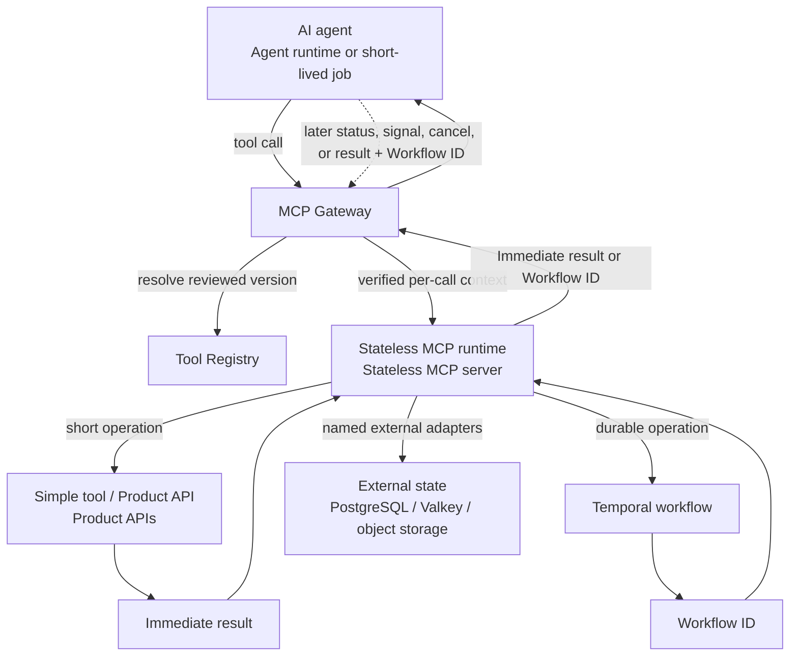

# ADR-0027: Stateless reliability qualification and saturation scaling

- Status: Accepted
- Date: 2026-08-31
- Tracking: [tesserix-mcp-runtime#29](https://github.com/tesserix/tesserix-mcp-runtime/issues/29)
- Supersedes: ADR-0008 for production session ownership and ADR-0022 for the
  measured autoscaling decision only

## Context and quantitative envelope

Every Tesserix MCP deployment must be horizontally interchangeable: a request
may reach any healthy pod and must not depend on a prior call reaching that
pod. The monthly invocation availability target is 99.9%. Qualification uses
at least 50 calls/second sustained, 200 calls/second burst, a 60,000-byte request,
a 500,000-byte response, no more than 15 ms in-process runtime-added p99 latency,
startup within two seconds, and idle RSS no greater than 128 MiB.

The observed capacity plan uses 210 burst calls/second and a conservative
250 ms product-handler p99. That is `210 * 0.250 = 52.5` concurrent calls. A
pod admits at most 64 calls and scales at 50% normal occupancy, giving 32 calls
per pod. Therefore `ceil(52.5 / 32) = 2`; the availability floor is also two.
The checked-in range is two to ten replicas. Peak observed RSS is 112 MiB, so
the pod requests 128 MiB and is limited to 256 MiB. The workload is primarily
I/O-bound, so no CPU limit is imposed; throttling would turn saturation into a
latency failure.

The assets are tenant authority, workload credentials, tool arguments and
results, idempotency authority, durable workflow state, Registry routes, and
reliability evidence. Threat actors include unauthenticated callers,
authenticated callers from another tenant, a compromised dependency or
container, and a publisher presenting invented or stale evidence. Trust is
crossed at Gateway authentication, MCP request validation, every backing call,
external state ownership, and evidence publication. Each crossing validates a
bounded contract and evidence retains no raw tenant value, credential, payload,
or result.

## Decision

The platform topology is:

The Gateway-to-Registry edge is control-plane discovery and exact version
resolution; it does not turn Registry search results into invocation authority.
The Gateway-to-runtime edge carries the verified, bounded per-call authority.
The three outbound runtime edges are explicit adapters: Product APIs remain
their domain authority, a Temporal workflow persists waits and resumability,
and External state holds only data owned by its named system. A long-running
operation returns a durable workflow or artifact reference; an MCP pod does not
remain alive to remember its progress.

The runtime returns either the Immediate result or an opaque Workflow ID through
the MCP Gateway. A later status, signal, cancel, or result call carries that
Workflow ID together with fresh verified identity, tenant authority,
authorization, request and trace identifiers, and any required idempotency key.
It can reach the same or a different pod. The Workflow ID is a lookup reference,
not authorization, and neither the Gateway nor the MCP pod keeps a caller-to-
workflow session map.

The PostgreSQL / Valkey / object storage edge represents named external
adapters, not permission to bypass a Product API's data-ownership boundary.
Valkey is Redis-protocol compatible but remains a bounded cache, coordination,
or rate-limit store rather than a source of truth. Temporal owns workflow
history and resumability; the MCP runtime owns only the current transaction.

### The MCP data plane is stateless

The MCP runtime owns no durable state about an agent, user, tenant,
conversation, previous tool call, or idempotency decision. Every call is a
fresh transaction carrying verified workload identity, tenant authority, tool
name and bounded arguments, authorization, request and trace identifiers, an
idempotency key for mutations, and an optional opaque conversation reference.
Identity and tenant authority come from the verified Gateway context, never
from a caller-controlled argument.

State that must survive a call is external:

- the Registry owns tool definitions, schemas, versions, routes, and lifecycle;
- PostgreSQL or the backing application's system of record owns domain state;
- Valkey may own bounded cache, rate-limit, or idempotency coordination but is
  never the source of truth;
- object storage owns artifacts and large results;
- Temporal owns durable waiting, approval, retry, resume, and multi-step
  workflow history; and
- the Gateway owns authentication, tenant policy, distributed rate limits, and
  audit admission.

### Every call reconstructs its complete authority

The production rule is that every call includes or derives the following
bounded envelope. Values marked as derived come from a previously verified
authority; a caller cannot override them in tool arguments.

| Required value | Authoritative derivation and handoff rule |
| --- | --- |
| Authenticated identity and tenant | Verified Gateway token and trusted forwarding contract; revalidated at every MCP and backing-service boundary |
| Tool and schema version | Exact immutable Registry capability reference, tool version, and input/output schema fingerprints activated for the route |
| Idempotency key for writes | Caller or workflow logical-operation key, scoped to tenant and immutable capability version, plus a canonical request digest |
| Correlation and trace IDs | Fresh request ID plus propagated W3C trace and logical-operation correlation ID; identifiers are hashed in retained evidence |
| Workflow or resource reference | Opaque tenant-scoped reference carried on later calls, or deterministically derived on the first start |
| Timeout and retry policy | Caller deadline narrowed by runtime/tool limits, one named retry owner, finite attempts, and jittered backoff |
| Authorisation context | Verified scopes, tool effect, approval reference, policy revision, and tenant/object checks; default deny on disagreement |

The product's authoritative store owns mutation idempotency. A typical
PostgreSQL record has a unique `(tenant, capability, version, idempotency_key)`
scope, the canonical request digest, `in_progress` or terminal status, and the
result, resource, or workflow reference needed to replay the response. The
same key and digest returns the original status or result without repeating
the effect; the same key with a different request digest returns a stable
conflict. The MCP runtime only propagates the verified key and digest. Valkey
may accelerate coordination, but expiry or loss of a cache entry cannot permit
a second effect.

For a durable operation, the Temporal Workflow ID is the stable logical handle
returned to the caller and can also be the start idempotency key. A Temporal Run ID
may change across Continue-As-New, retry, or reset and is not the client
handle. Each activity derives a stable tenant/capability/workflow/step
idempotency key for its product API call. Temporal owns history and retry state;
PostgreSQL may expose a query projection, but does not become a second workflow
state machine. Status, signal, cancel, and result calls reauthenticate and
reauthorize the opaque reference on every request.

### PostgreSQL authority and Qdrant projection

Registry PostgreSQL is the source of truth for tenant ownership, capability
metadata, immutable versions, lifecycle state, and schema fingerprints. A
transactional outbox projects committed searchable metadata to Qdrant when the
Registry deployment uses it. Qdrant is a rebuildable, tenant-filtered semantic
index: it ranks candidate capability references, but never owns authorization,
idempotency, workflow history, or a selected tool version. The Registry reloads
the exact candidate from PostgreSQL and reapplies tenant, lifecycle,
compatibility, and policy filters before the Gateway can activate or invoke it.

If Qdrant is unavailable, new semantic discovery degrades or fails visibly;
already activated routes and calls using an exact authorized capability remain
independent of it. If projection delivery is duplicated, the Qdrant upsert is
idempotent by immutable capability/version key. If delivery is delayed, search
may be stale but exact PostgreSQL validation prevents stale or cross-tenant
authority from becoming execution permission.

Bounded reconstructible process state is allowed only when correctness does
not depend on it: active-call cancellation handles, concurrency counters,
metrics, circuit-breaker state, and short-lived verified-key or control-plane
caches. Losing any of them on restart may reduce efficiency or temporarily
fail closed, but cannot lose a completed effect or require session affinity.
The container root filesystem is read-only and request-owned filesystem state
is zero.

Production Streamable HTTP uses the official SDK in stateless mode. A
`Mcp-Session-Id` is rejected instead of becoming pod affinity. The optional
stateful compatibility surface described by ADR-0008 is not an approved
Tesserix deployment or Registry publication pattern. The ClusterIP Service
sets session affinity to `None`, and reliability evidence alternates at least
two replicas while proving all calls succeed, no request-owned memory or files
remain, and duplicate delivery causes one external effect.

### Evidence is executed, bounded, and digest-bindable

`tesserix-mcp-testkit` provides lane-bound load, soak, dependency, retry,
rollout, and stateless runners. Evidence models reject unknown fields and
unbounded work. Reports contain only counts, bounded timings, outcomes, and
SHA-256 digests. In-process, direct HTTP, and pinned AgentGateway lanes cannot
be relabelled as one another.

The offline harness executes deterministic faults rather than constructing
passing rows. A Registry outage continues through last-known-good metadata. An
AgentGateway outage returns unavailable without consuming runtime capacity. An
identity refresh uses only the bounded stale verified-key window and then fails
closed. A blocked telemetry exporter drops from a bounded queue and counts the
drop. DNS and backing-API latency or outage are isolated per destination and
open the circuit breaker. Unaffected calls must continue in every case.

Only the runtime owns application retries in the qualified profile, with at
most three attempts, exponential backoff and jitter in production adapters,
and no client, AgentGateway, or mesh retry amplification. Duplicate mutation
delivery uses one external idempotency key and records one effect. There is no
claim of exactly-once delivery; at-least-once delivery plus an idempotent
external authority is the contract.

SIGTERM, pod eviction, rolling update, canary abort, and rollback scenarios
admit bounded work, reject new work after drain begins, finish accepted calls
inside the 45-second grace period, preserve previous capacity, and restore the
last-known-good route. Drain duration and user-visible interruption are
separate counters because a zero-unavailable rollout can drain for seconds
without interrupting traffic.

### Scaling follows the measured saturation signal

The reference HorizontalPodAutoscaler uses the per-pod
`mcp_server_saturation_ratio` metric with a 0.5 average target, a two-replica
floor, a ten-replica ceiling, and 300-second scale-down stabilization. This
supersedes ADR-0022's decision to omit a generic autoscaler because issue #29
now supplies the missing bounded load evidence and machine-readable capacity
plan. Product adoption must repeat the calculation with its own handler p99,
peak rate, memory profile, and external dependency limits.

## Failure behavior, rollout, and rollback

A malformed plan, mixed lane, decreasing counter, retained identifier, missing
replica, local request state, session affinity, duplicate effect, retry
amplification, unbounded queue, or stale artifact binding denies qualification.
A runner cancellation propagates and cancels sibling work. Registry and
telemetry faults degrade; identity fails closed; DNS, backing API, and Gateway
faults return stable unavailable or timeout outcomes. Optional dependencies do
not change liveness.

The reference remains non-deployable and is adopted through a reviewed
`tesserix-k8s` change. Canary promotion leaves the previous route and image
valid through the observation window. A canary abort changes no user traffic.
Rollback is one Git revert followed by Argo CD reconciliation; no imperative
cluster mutation is part of this decision. Stateless data-plane RPO is zero
because the pod owns no durable state. Product-data RPO remains the external
system owner's responsibility. The post-cutover route-recovery RTO remains
five minutes.

## Cost and alternatives

The two-replica floor reserves 256 MiB and permits 512 MiB before OOM
isolation. Ten replicas reserve 1.25 GiB and permit 2.5 GiB. The custom metric
adapter, telemetry retention, Gateway cross-zone traffic, and backing-service
capacity add product-specific cost. Slow scale-down trades some idle capacity
for fewer flaps and safer recovery.

Sticky sessions or pod-local idempotency were rejected because pod loss would
lose correctness and horizontal scaling would require affinity. Persisting
workflow state in the MCP process was rejected because approval, waiting, and
resume must survive restarts; Temporal owns that lifecycle. Retrying at every
layer was rejected because attempts multiply during an outage. CPU-based
autoscaling was rejected for this I/O-bound runtime because in-flight
saturation is the work signal. A single replica was rejected because it cannot
meet the availability or cross-replica statelessness contract.

## Consequences

Any pod can handle the next call, failed pods are disposable, and data-plane
rollouts do not move durable state. Authors must design mutations around an
external idempotency authority and move long-running work to Temporal or the
owning application. Operators must expose the saturation metric through the
cluster metrics adapter and repeat capacity measurements for each product MCP.
Compatibility support for stateful protocol tests remains outside the approved
production pattern and cannot be used to justify sticky routing.
