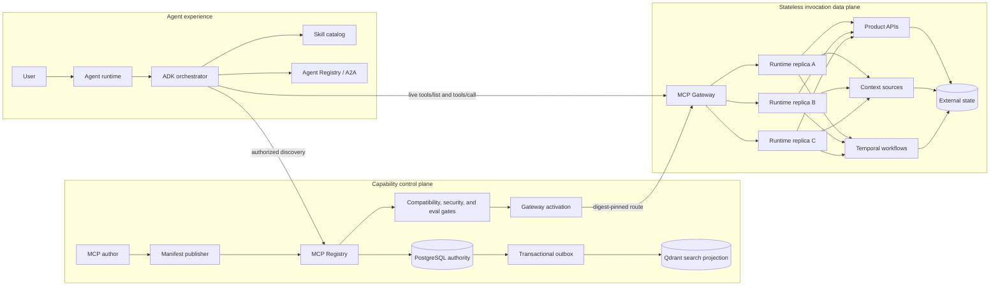
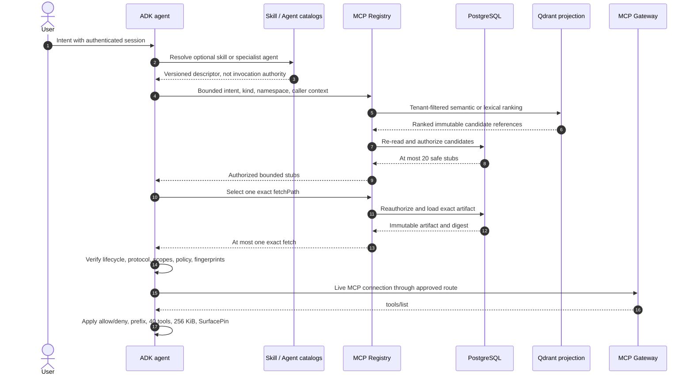
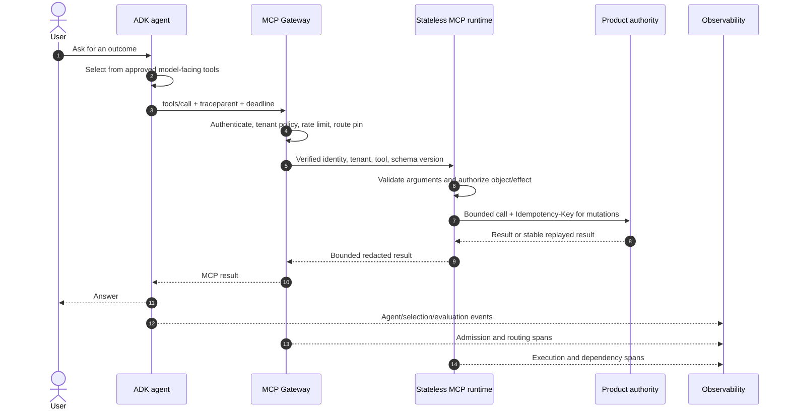
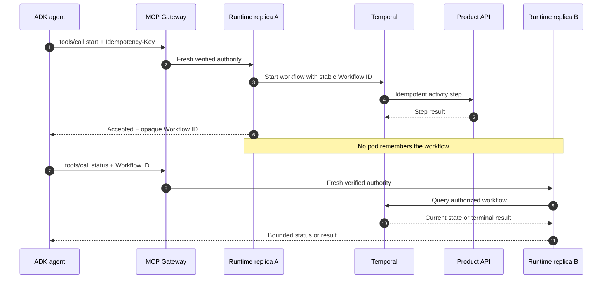

# ADR-0031 (RFC): Stateless agent capability discovery and assembly

## Status

- Status: Accepted
- Date: 2026-09-02
- Document type: Integrating RFC and recorded architecture decision
- Supplements: [ADR-0017](0017-bounded-semantic-discovery-authoring.md),
  [ADR-0018](0018-identity-scoped-registry-discovery.md),
  [ADR-0020](0020-digest-bound-gateway-activation.md),
  [ADR-0026](0026-digest-bound-evaluation-promotion.md), and
  [ADR-0027](0027-stateless-reliability-qualification.md)

This RFC integrates existing accepted decisions into one product journey. It
does not replace their detailed contracts or claim that an Agent Registry,
Skill catalog, Registry producer, Gateway controller, or product deployment is
owned by this package.

## Context and quantitative envelope

An agent must find a small, authorized set of capabilities without loading the
whole organization catalog into model context. The word "capability" spans
four distinct things which must not be conflated:

- executable operations in the MCP Tool catalog;
- reusable instructions in an ADK-owned Skill catalog;
- delegable agents in an Agent Registry; and
- tenant data exposed by approved Context sources.

The current Registry discovery envelope is 2,000 artifacts across 50
namespaces and 50 read-only searches/second at peak. It returns at most 20 safe
stubs, performs at most one exact fetch, accepts 128 KiB of search JSON and
512 KiB of exact artifact
JSON. Cold resolution targets p99 below 400 ms. A live ADK declaration exposes
at most 40 tools and 256 KiB of aggregate schemas. The runtime qualification
envelope is 50 calls/second sustained and 200 calls/second burst for each
product MCP deployment, with 99.9% monthly invocation availability.

Planning assumptions, rather than release commitments, are:

| Horizon | Catalog artifacts | Namespaces | Peak discovery reads | Metadata at 32 KiB/artifact |
| --- | ---: | ---: | ---: | ---: |
| Current | 2,000 | 50 | 50/s | about 64 MiB |
| 12 months | 10,000 | 250 | 100/s | about 320 MiB |
| 36 months | 50,000 | 1,000 | 250/s | about 1.6 GiB |

These volumes remain a Registry indexing and PostgreSQL concern. They do not
justify a second catalog, embedding model, or vector database in each MCP
runtime. The design must be re-measured before exceeding any row, p99 above
400 ms, or a normal discovery projection above 1,500 model tokens.

## Decision

Tesserix separates capability discovery from invocation authority and assigns
one owner to each catalog:

| Capability | Authority | Agent-facing contract | Runtime responsibility |
| --- | --- | --- | --- |
| MCP tools | MCP Registry, then live MCP server | Bounded Registry stubs, exact artifact, `tools/list` | Declare safe metadata, verify policy, execute `tools/call` |
| Skills | ADK Skill catalog | Versioned skill descriptor and instructions | None; a skill may reference approved tool capabilities |
| Agents | Agent Registry and orchestrator | Versioned agent card or A2A delegation contract | None; an agent may deliberately expose a bounded MCP tool |
| Context | Owning product or retrieval service | Tenant-scoped resource or read-only retrieval tool | Validate, authorize, bound, and redact the exposed result |

The ADK is the assembly point. It receives the user intent and verified caller
context, resolves an appropriate skill or agent where required, asks the MCP
Registry for relevant tool servers, converts the accepted exact artifact into
an MCP server configuration, performs live MCP discovery through the Gateway,
and gives the model only the bounded approved surface.

Semantic relevance ranks candidates; it never grants access. Invocation
requires fresh identity, tenant, lifecycle, compatibility, scope, policy,
schema-fingerprint, route, and live-surface checks. A no-good-match result is a
normal outcome and never falls back to the full catalog.

No new network API is introduced by this decision. The runtime continues to
use the shipped bounded Registry search and exact-fetch contracts. Agent and
Skill catalogs remain external ADK/orchestrator dependencies. Cross-agent
delegation uses an Agent Registry or A2A contract, not an overloaded MCP tool
search.

## Architecture

The control plane publishes, indexes, evaluates, and activates immutable
capabilities. The data plane handles one independently authorized invocation
at a time.

PostgreSQL owns immutable Registry records and tenant authorization. Qdrant is
a rebuildable semantic projection. It may rank candidate references, but it
cannot authorize a tenant, select a lifecycle, approve a schema, or create a
Gateway route. Exact data is reloaded from PostgreSQL before use. ADR-0017's
older reference to Registry-owned `pgvector` does not create a second index or
a runtime dependency; this integrating decision follows ADR-0027's current
Qdrant projection while leaving the Registry responsible for its implementation.

The Tool catalog is not an agent catalog. A specialist agent may be selected
through an Agent Registry and then use MCP tools through its own bounded ADK
surface. If a stable agent operation is intentionally presented as a tool, its
MCP manifest must still obey the same schema, authorization, evaluation, and
idempotency contracts.

## Discovery workflow

Discovery uses progressive disclosure so irrelevant or unauthorized catalog
content never reaches the model.

The search request derives issuer, tenant, subject, and scopes from verified
authority; it never accepts them from free-form intent. Search results contain
safe bounded stubs rather than full artifacts. The resolver preserves Registry
ranking, performs cheap compatibility filtering, and fetches one exact object.
If that object fails exact validation, resolution returns a typed no-match or
failure instead of browsing progressively through private candidates.

ADK owns live namespacing, collision rejection, schema budgets, and
`SurfacePin` verification. Registry-reviewed schema fingerprints and an ADK
live `SurfacePin` are related evidence but are not interchangeable.

## Invocation workflow

Every invocation reconstructs complete authority and can land on a different
pod from discovery or any previous call.

The runtime owns no durable user, agent, tenant, conversation, previous-call,
or mutation-deduplication state. It may retain bounded reconstructible process
state such as concurrency counters, active cancellation handles, circuit
breakers, metrics, and short authorization caches. Loss of that state may
reduce efficiency or fail closed, but cannot lose a completed effect.

Production uses stateless Streamable HTTP, rejects `Mcp-Session-Id`, and
requires no session affinity. The next request may reach any healthy replica.
The owning product database enforces mutation idempotency with a unique tenant,
capability, version, and key scope plus a canonical request digest. Reusing the
same key and digest returns the recorded result; reusing the key with different
arguments returns a stable conflict.

## Durable workflow

Long waits, approvals, retries, and multi-step effects are not held inside an
MCP request or pod. Temporal or the product's durable workflow authority owns
them.

The Workflow ID is an opaque tenant-scoped lookup reference, not authority.
Every status, signal, cancellation, and result request reauthenticates and
reauthorizes it. Temporal activities are at-least-once and use stable
step-level idempotency keys. A workflow with a non-compensatable pivot moves
forward through finite retries and operator escalation rather than pretending
to offer a distributed rollback.

## Security and tenancy

Protected assets are tenant catalog existence, tool arguments and results,
credentials, capability metadata, authorization decisions, workflow
references, and ranking integrity. Threat actors include an unauthenticated
caller, an authenticated caller from another tenant, a malicious publisher,
prompt-injection text in metadata or context, a compromised dependency, and a
forged or stale Registry response.

Trust boundaries and required checks are:

| Boundary | Required behavior |
| --- | --- |
| User to agent | Authenticate the user; derive tenant and subject server-side |
| Agent to catalogs | Tenant-filter before projection; return no hidden-candidate details |
| Registry stub to exact fetch | Same-origin relative fetch, identity/digest match, fresh object authorization |
| ADK to Gateway | Operator-controlled HTTPS origin, bounded live surface, collision and pin checks |
| Gateway to runtime | Verify issuer, audience, expiry, algorithm, tenant, scopes, route, and deadline |
| Runtime to tool | Default deny; authorize the named object and effect, not only the route |
| Runtime to dependency | Destination allowlist, connection-pinned HTTPS, finite timeouts, redaction |

Relevance scores, model choices, skill references, agent cards, workflow IDs,
cache hits, and Registry stubs never become authorization. Publisher-controlled
URLs never grant egress. Search failure does not expose an unfiltered catalog.
Cross-tenant lookup returns an indistinguishable no-match or not-found result.
Credentials, raw identities, tool arguments, context documents, and results
are excluded from retained discovery explanations and telemetry.

## Observability and evaluation

One W3C `traceparent` follows the user turn through ADK, Registry, Gateway,
runtime, and named dependencies. Logical stages should be represented by spans
for agent planning, catalog resolution, exact fetch, live tool discovery,
Gateway admission, runtime execution, and downstream work. Component owners
may retain their established span names; this RFC standardizes correlation and
attributes rather than creating a second tracing vocabulary.

Retained attributes are bounded identifiers and decisions: tenant hash,
agent/skill/tool version, Registry artifact digest, route revision, schema pin,
request ID, tool outcome, latency, token counts, evaluation bundle digest, and
stable rejection code. Tool arguments, context bodies, prompts, credentials,
and results are sensitive payloads and payloads are not recorded.

Evaluation is layered:

| Stage | Required measures |
| --- | --- |
| Discovery | precision@K, no-good-match accuracy, incompatible recommendations, forbidden exposure |
| Assembly | tool count/schema bytes, collision count, allow/deny outcome, live pin match |
| Selection | selected-tool accuracy, unnecessary-call rate, refusal/no-tool correctness |
| Execution | success/error/timeout rates, p50/p95/p99 duration, retry count, duplicate-effect count |
| Agent outcome | task completion score, groundedness, policy compliance, cost, end-to-end latency |

Registry ranking scores support relevance only. The currently shipped Registry
contract has no enforceable minimum-score budget, so the runtime does not
invent one. Offline evaluation bundles are digest-bound to dataset, agent,
model, prompt/skill, Registry artifact, Gateway route, and runtime versions.
Promotion fails on any forbidden exposure, policy bypass, schema drift,
duplicate external effect, or missing evidence even if aggregate quality is
high.

## Dependency failure behavior

| Failure | Required behavior |
| --- | --- |
| Skill catalog or Agent Registry unavailable | Continue only when an already selected, version-pinned local declaration is authorized; otherwise fail that delegation visibly |
| Qdrant unavailable | New semantic ranking degrades or fails visibly; exact authorized routes remain usable |
| Registry search unavailable | Use no unfiltered fallback; an explicitly permitted identity-scoped lease may apply |
| Exact fetch unavailable | Use only the bounded verified stale policy from ADR-0018 or fail unavailable |
| Registry race or digest mismatch | Fail the resolution and restart later; never invoke the moving candidate |
| Gateway unavailable | Return unavailable before consuming runtime capacity |
| Runtime replica fails | Retry a safe call on another replica within the original deadline; mutations retain the same key |
| Product dependency times out | Cancel within the narrowed deadline; retry only the named retry owner's safe cases |
| Duplicate mutation delivery | External authority returns the original result and records one effect |
| Telemetry exporter blocks | Drop from a bounded queue, count the drop, and preserve invocation availability |
| Temporal unavailable | New durable work fails visibly; existing workflow history remains Temporal-owned |

Retries apply only to timeouts, connection resets, `429`, and selected `5xx`
responses when the operation is safe or idempotent. They use exponential
backoff with jitter, a finite attempt cap, and the original deadline. A client,
Gateway, mesh, runtime, and product API must not all retry the same call.

## Rollout and rollback

Rollout is progressive and fail closed:

1. Publish bounded semantic metadata and pass manifest lint, compatibility,
   security, and discovery evaluations.
2. Run identity-scoped Registry resolution in shadow mode with an empty tool
   allowlist; compare against the existing static ADK configuration.
3. Activate one digest-pinned Gateway route with reviewed schema fingerprints
   and live `SurfacePin` evidence.
4. Canary a small tenant cohort while comparing discovery quality, tool
   selection, latency, forbidden exposure, and duplicate-effect counters.
5. Promote only a digest-bound evidence bundle reviewed independently from the
   publisher and agent author.

Rollback removes the optional discovery wiring or restores the previous static
`McpServerConfig` and digest-pinned Gateway route. Repository rollback is one Git revert
followed by normal GitOps reconciliation. Immutable Registry
versions and evaluation evidence remain for audit; no tag, database row, or
workflow history is deleted. In-flight durable work continues under its pinned
workflow and capability versions.

The runtime adds no database, vector store, queue, or baseline service cost.
Costs remain with Registry PostgreSQL and Qdrant, catalog traffic, Gateway
cross-zone traffic, model tokens for bounded stubs/schemas, telemetry
retention, and the two-replica minimum for each product MCP. Owners must report
those costs before product rollout.

## Alternatives considered

- Give every agent the complete MCP catalog: rejected because it breaches
  token budgets, increases confused selection, and risks unauthorized metadata
  exposure.
- Add embeddings, Qdrant, or a full catalog cache to every runtime: rejected
  because Registry already owns ranking, tenancy, consistency, and recovery.
- Let a relevance score grant invocation: rejected because probabilistic
  ranking is not authentication, authorization, lifecycle, or schema approval.
- Discover agents as ordinary MCP tools: rejected because conversational
  delegation, lifecycle, identity, and task ownership require an Agent Registry
  or A2A contract. A deliberately bounded agent operation may still expose an
  MCP tool.
- Store conversations or workflow progress in the runtime pod: rejected
  because restart, scaling, and rollout would lose correctness and require
  session affinity.
- Fetch candidates until one passes policy: rejected because it expands
  private data access, creates variable latency, and weakens progressive
  disclosure.
- Retry independently at every layer: rejected because retry multiplication
  overloads an already failing dependency and duplicates side effects.

## Consequences

Agents receive small, relevant, versioned, and authorized capability surfaces;
the runtime remains horizontally interchangeable; and every durable effect has
an external owner. Tool, skill, context, and agent discovery can evolve at
different cadences without turning one catalog into universal authority.

The deliberate cost is more explicit integration work: authors must provide
quality metadata, operators must activate digest-pinned routes, ADK consumers
must maintain live surface pins and tool budgets, and product APIs must enforce
idempotency. Discovery can fail closed even when a human believes a relevant
tool exists. That is preferred to silently exposing or executing an
unauthorized capability.
