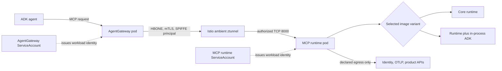
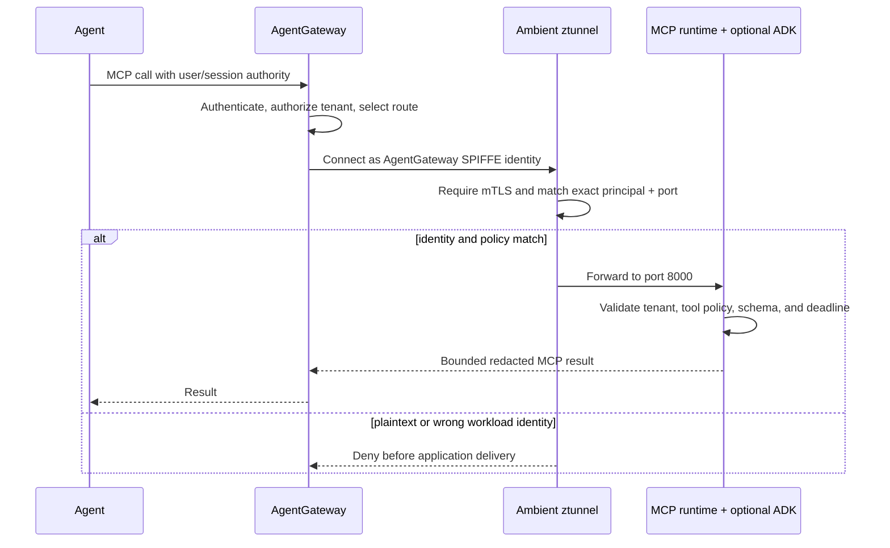

# ADR-0032: Istio ambient workload identity for MCP runtime variants

## Status

- Status: Accepted
- Date: 2026-09-02
- Supplements: [ADR-0004](0004-cross-system-threat-model.md),
  [ADR-0010](0010-gateway-jwt-and-tenant-context.md), and
  [ADR-0022](0022-container-and-gitops-deployment.md)

## Context

The Kubernetes reference already uses a dedicated keyless ServiceAccount,
non-root containers, a read-only filesystem, and default-deny network policy.
Those controls do not by themselves authenticate the AgentGateway workload or
encrypt pod-to-pod traffic. An Istio ambient deployment needs an explicit
workload identity and policy contract without making the portable base depend
on Istio CRDs.

The core and ADK images are alternative variants of the same MCP server. The
ADK is loaded inside the runtime process; it is not a separately schedulable
security principal. Claiming a distinct ADK mesh identity inside that process
would create a boundary that Kubernetes and Istio cannot enforce.

## Decision

Provide an opt-in `deploy/kubernetes/overlays/istio-ambient` Kustomize overlay.
It preserves the portable base and adds three fail-closed controls:

1. `istio.io/dataplane-mode: ambient` enrolls only the MCP workload, so
   adoption does not silently mesh every workload in its namespace.
2. workload-selected `PeerAuthentication` requires `STRICT` mutual TLS;
3. workload-selected `AuthorizationPolicy` permits port 8000 only from the
   exact AgentGateway SPIFFE principal.

The Kubernetes ServiceAccount is the identity root. Istio derives the runtime
principal as
`spiffe://<trust-domain>/ns/<namespace>/sa/mcp-server-reference`. The core and
ADK image variants intentionally receive this same identity because they are
mutually exclusive implementations of the same workload. If ADK behavior must
have independent authority, it must move to a separate Deployment,
ServiceAccount, Service, and policy set and communicate over an authenticated
network contract.

The checked-in AgentGateway principal is a replacement value and therefore
fails closed. Product adoption must replace its trust domain, namespace, and
ServiceAccount with the values rendered by the owning GitOps repository.

## Identity and traffic architecture

The mesh authenticates workload-to-workload transport. AgentGateway still
authenticates the end user and supplies signed tenant context, and the runtime
still performs tool- and object-level authorization. A mesh identity never
replaces application authorization.

## Request workflow

## Security invariants

- Do not use wildcard principals, namespaces, trust domains, or ports.
- Keep `automountServiceAccountToken: false`; mesh identity does not require an
  application-visible Kubernetes API token.
- Keep the Kubernetes `NetworkPolicy`. Ambient authorization and network
  policy are complementary identity and reachability controls.
- Keep JWT, tenant, scope, tool, and object authorization in Gateway and
  runtime code. SPIFFE identifies a workload, not a user or tenant.
- Do not add a waypoint merely to claim stronger security. The current policy
  uses ztunnel-enforced L4 identity. Add a waypoint only when a measured need
  requires L7 mesh policy, then update NetworkPolicy peers and test the exact
  routed path.
- Validate kubelet probes, telemetry, identity, and backing API egress in the
  adopted cluster. Mesh success does not prove those product-specific paths.

## Consequences

This design gives both runtime variants encrypted, mutually authenticated
transport and denies callers without the reviewed Gateway workload identity.
It does not create a second identity for an in-process library, introduce a
sidecar, or make Istio mandatory for users of the base manifests. Trust-domain
and product identity replacement remains an explicit GitOps adoption step.
